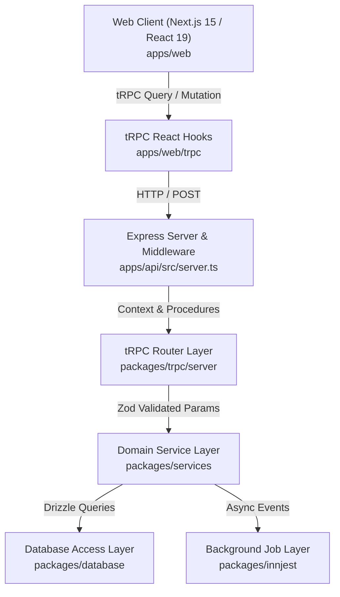

# 💻 LeafForm Code Design Specification (ASD-STE100)

This document specifies the code standards, software layers, and safety checks in the LeafForm monorepo. Write all technical documentation in clear and direct language.

---

## 1. Core Engineering Rules

1. **Keep Type Safety**: Server types automatically infer to client tRPC hooks. Do not write manual contracts or run code generation tools.
2. **Separate Concerns**: Put presentation logic in the `apps/` directory. Put business logic, database models, and API routes in the `packages/` directory.
3. **Keep Services Pure**: Domain services in [packages/services](file:///home/dron/Documents/programming/monoreop-tRPC/packages/services) must not depend on Express or tRPC. Services receive typed objects and return data.
4. **Validate Payloads**: Use Zod schemas to parse and sanitize all incoming API requests before execution.
5. **Enforce Consistency**: Use automated Git hooks to block commits that contain lint errors, bad formatting, or broken TypeScript types.

---

## 2. Layered Architecture



### 2.1 Database Access Layer (`packages/database`)

- **ORM**: Drizzle ORM with PostgreSQL database.
- **Location**: See [schema.ts](file:///home/dron/Documents/programming/monoreop-tRPC/packages/database/schema.ts) and [models/](file:///home/dron/Documents/programming/monoreop-tRPC/packages/database/models).
- **Rule**: Export TypeScript types for all database tables (`InferSelectModel`, `InferInsertModel`). Map complex JSONB properties using Drizzle's `.$type<T>()` modifiers (e.g. `FieldValidationConfig`) to prevent type skipping or the use of `any`.

### 2.2 Domain Business Services (`packages/services`)

- **Form Service**: See [form/core.ts](file:///home/dron/Documents/programming/monoreop-tRPC/packages/services/form/core.ts) for form creation, field validation, and submission processing.
- **User Service**: See [user/core.ts](file:///home/dron/Documents/programming/monoreop-tRPC/packages/services/user/core.ts) for user registration, authentication, and password hashing.
- **Rule**: Return standard success or error objects. Do not read HTTP request objects directly inside services.

### 2.3 API Router Layer (`packages/trpc`)

- **Location**: See [trpc.ts](file:///home/dron/Documents/programming/monoreop-tRPC/packages/trpc/server/trpc.ts) and [routes/](file:///home/dron/Documents/programming/monoreop-tRPC/packages/trpc/server/routes).
- **Procedures**:
  - `publicProcedure`: Open procedure with analytics middleware.
  - `TokenBasedProcedure`: Protected procedure with `verifyToken` middleware. It reads JWT tokens from cookies or authorization headers.
- **Rate Limiter**: The `fixedWindowRateLimiter` limits requests to 100 requests per minute per IP address with Redis.

### 2.4 Application Delivery Layer (`apps/api` and `apps/web`)

- **Backend API**: The Express server in [apps/api/src/server.ts](file:///home/dron/Documents/programming/monoreop-tRPC/apps/api/src/server.ts) handles CORS, cookie parsing, OpenAPI documents (`/openapi.json`), and API documentation (`/docs`).
- **Web Frontend**: Next.js App Router in [apps/web/app](file:///home/dron/Documents/programming/monoreop-tRPC/apps/web/app) uses custom hooks and tRPC providers (`TRPCProvider`).

---

## 3. Automated Safety Checks

Husky git hooks run automated safety checks during code development.

### 3.1 Pre-Commit Safety Checks (`.husky/pre-commit`)

Husky runs two commands before you save a Git commit:

1. **Prettier Formatting**: Formats code files according to rules in [prettier.config.js](file:///home/dron/Documents/programming/monoreop-tRPC/prettier.config.js).
2. **ESLint Static Analysis**: Scans code for syntax errors and bad imports using [eslint.config.js](file:///home/dron/Documents/programming/monoreop-tRPC/eslint.config.js).

```bash
pnpm format
pnpm lint
```

### 3.2 Commit Message Validation (`.husky/commit-msg`)

Commitlint checks all commit messages against [commitlint.config.js](file:///home/dron/Documents/programming/monoreop-tRPC/commitlint.config.js).

- **Allowed Prefixes**: `feat:`, `fix:`, `docs:`, `style:`, `refactor:`, `perf:`, `test:`, `chore:`, `revert:`, `ci:`.
- **Valid Example**: `feat(form): add rating field component validation`

### 3.3 Pre-Push Type Safety Check (`.husky/pre-push`)

Husky verifies all TypeScript types before you push code to remote branches:

```bash
pnpm check-types
```

---

## 4. Error Handling and Response Standards

- **API Errors**: Throw standard `TRPCError` instances (`UNAUTHORIZED`, `BAD_REQUEST`, `NOT_FOUND`, `TOO_MANY_REQUESTS`).
- **Response Utilities**: Use response helpers from [packages/utils](file:///home/dron/Documents/programming/monoreop-tRPC/packages/utils) (`apiRes`, `apiErr`, `hashIT`, `jwtUtils`).
- **Logging**: Use the structured logger from [packages/logger](file:///home/dron/Documents/programming/monoreop-tRPC/packages/logger). Do not use `console.log` in server packages.
