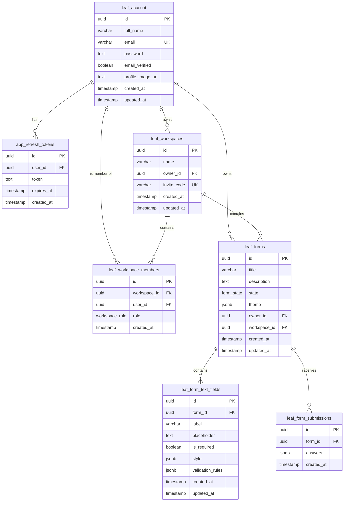

# LeafForm Database Schema Design Specification

This document describes the schema architecture, table structures, and relationships for the LeafForm database. The database is powered by PostgreSQL and modeled using Drizzle ORM.

---

## 1. Entity Relationship Overview

---

## 2. Table Definitions

### 2.1 Accounts & Authentication

#### `leaf_account` (Users Table)
Stores user account credentials, profile images, and verification status.

| Column | Data Type | Constraints / Default | Description |
| :--- | :--- | :--- | :--- |
| `id` | `uuid` | Primary Key, `defaultRandom()` | Unique user identifier |
| `full_name` | `varchar(80)` | Not Null | User's full name |
| `email` | `varchar(255)` | Not Null, Unique | User's email (login credential) |
| `password` | `text` | Nullable | Encrypted password (optional for OAuth) |
| `email_verified`| `boolean` | Default: `false` | Account verification flag |
| `profile_image_url` | `text` | Nullable | User avatar image URL |
| `created_at` | `timestamp` | Default: `now()` | Timestamp of account creation |
| `updated_at` | `timestamp` | On Update: `now()` | Timestamp of last account update |

#### `app_refresh_tokens`
Stores JWT refresh tokens for session management.

| Column | Data Type | Constraints / Default | Description |
| :--- | :--- | :--- | :--- |
| `id` | `uuid` | Primary Key, `defaultRandom()` | Unique token identifier |
| `user_id` | `uuid` | Not Null, Foreign Key | References `leaf_account.id` (Cascade Delete) |
| `token` | `text` | Not Null | Hashed/plain refresh token string |
| `expires_at` | `timestamp` | Not Null | Expiry date and time |
| `created_at` | `timestamp` | Default: `now()` | Token creation timestamp |

---

### 2.2 Workspaces & Members

#### `leaf_workspaces`
Groups forms and manages access control permissions.

| Column | Data Type | Constraints / Default | Description |
| :--- | :--- | :--- | :--- |
| `id` | `uuid` | Primary Key, `defaultRandom()` | Unique workspace identifier |
| `name` | `varchar(255)` | Not Null | Workspace name |
| `owner_id` | `uuid` | Not Null, Foreign Key | References `leaf_account.id` (Cascade Delete) |
| `invite_code` | `varchar(12)` | Not Null, Unique | Direct workspace invitation code |
| `created_at` | `timestamp` | Default: `now()` | Workspace creation timestamp |
| `updated_at` | `timestamp` | On Update: `now()` | Workspace last update timestamp |

#### `leaf_workspace_members`
Defines role-based membership permissions within workspaces.

| Column | Data Type | Constraints / Default | Description |
| :--- | :--- | :--- | :--- |
| `id` | `uuid` | Primary Key, `defaultRandom()` | Unique member row identifier |
| `workspace_id` | `uuid` | Not Null, Foreign Key | References `leaf_workspaces.id` (Cascade Delete) |
| `user_id` | `uuid` | Not Null, Foreign Key | References `leaf_account.id` (Cascade Delete) |
| `role` | `workspace_role` | Default: `read` | Workspace role enum (`owner`, `read`, `write`) |
| `created_at` | `timestamp` | Default: `now()` | Membership creation timestamp |

---

### 2.3 Forms & Submissions

#### `leaf_forms`
Stores form metadata, state, and themes.

| Column | Data Type | Constraints / Default | Description |
| :--- | :--- | :--- | :--- |
| `id` | `uuid` | Primary Key, `defaultRandom()` | Unique form identifier |
| `title` | `varchar(255)` | Not Null | Form title |
| `description` | `text` | Nullable | Brief explanation of the form |
| `state` | `form_state` | Default: `drafted` | Enum state (`drafted`, `published`, `closed`) |
| `theme` | `jsonb` | Nullable | Theme properties conforming to `FormThemeConfig` |
| `owner_id` | `uuid` | Not Null, Foreign Key | References `leaf_account.id` (Cascade Delete) |
| `workspace_id` | `uuid` | Nullable, Foreign Key | References `leaf_workspaces.id` (Cascade Delete) |
| `created_at` | `timestamp` | Default: `now()` | Form creation timestamp |
| `updated_at` | `timestamp` | On Update: `now()` | Form last update timestamp |

#### `leaf_form_submissions`
Contains the submitted user answers/responses.

| Column | Data Type | Constraints / Default | Description |
| :--- | :--- | :--- | :--- |
| `id` | `uuid` | Primary Key, `defaultRandom()` | Unique submission identifier |
| `form_id` | `uuid` | Not Null, Foreign Key | References `leaf_forms.id` (Cascade Delete) |
| `answers` | `jsonb` | Not Null | Array of type `FormSubmissionAnswer[]` |
| `submitted_at` | `timestamp` | Default: `now()`, with timezone | Time response was recorded |
| `respondent_ip`| `varchar(255)` | Nullable | IP address of the respondent |

---

### 2.4 Form Fields & Configurations

#### `leaf_form_text_fields`
Defines structure, styling, and validation rules of individual form text fields.

| Column | Data Type | Constraints / Default | Description |
| :--- | :--- | :--- | :--- |
| `id` | `uuid` | Primary Key, `defaultRandom()` | Unique field identifier |
| `form_id` | `uuid` | Not Null, Foreign Key | References `leaf_forms.id` (Cascade Delete) |
| `label` | `text` | Not Null | The title/question displayed for the field |
| `description` | `text` | Nullable | Sub-text helping explain the question |
| `placeholder` | `text` | Nullable | Placeholder inside inputs |
| `is_required` | `boolean` | Default: `true`, Not Null | Whether the field requires input |
| `order_index` | `integer` | Default: `0`, Not Null | Layout order index for the field |
| `style` | `jsonb` | Nullable | Conforms to `FieldStyleConfig` (colors, borders, weights, size, type) |
| `validation_rules` | `jsonb` | Nullable | Conforms to `FieldValidationConfig` (patterns, length, required) |
| `default_value`| `text` | Nullable | The pre-filled value for the field |
| `created_at` | `timestamp` | Default: `now()` | Field creation timestamp |
| `updated_at` | `timestamp` | On Update: `now()` | Field last update timestamp |

