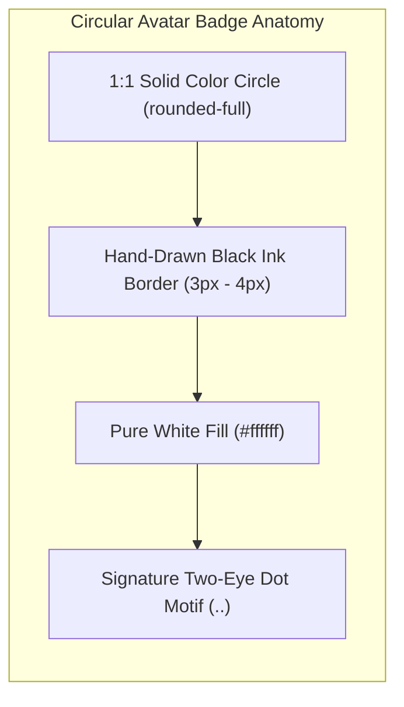
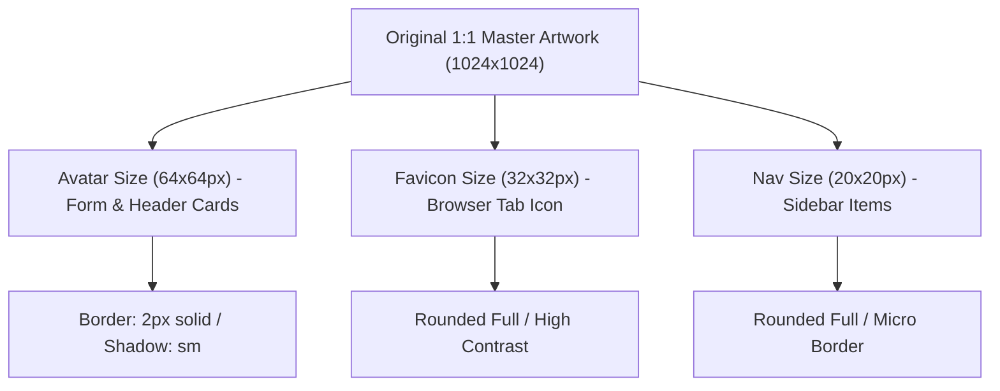

# 🎨 LeafForm - Official Logo Design Specs (`LOGO_DESIGN.md`)

This document defines the official design system, visual artstyle, ink stroke guidelines, two-eye dot motif, and monochrome color schema for all LeafForm circular avatar badge logos.

---

## 📐 1. Visual Anatomy & Design Principles

Every logo in the LeafForm ecosystem follows a unified hand-drawn circular avatar badge aesthetic inspired by minimalist doodle line art:



> [!IMPORTANT]
> **Key Visual Rules**:
> 1. **Solid Color Circle**: Every logo is centered inside a 1:1 aspect ratio solid colored circle badge (`rounded-full`).
> 2. **Hand-Drawn Ink Aesthetic**: Organic black ink outlines with thick `3px - 4px` visual stroke weight.
> 3. **Pure White Interior**: Icon shapes feature a clean `#ffffff` interior fill with high contrast.
> 4. **Signature Two-Eye Dots (`..`)**: Central object bodies include two black eye dots (`..`) giving functional icons a friendly personality.

---

## 🎨 2. Palette & Color Schema Specification

> [!NOTE]
> All generated logo image files (`.jpg`, `.png`, etc.) generated via Nano Banana / image generation tools are saved in [`etc/public/`](file:///home/dron/Documents/programming/monoreop-tRPC/etc/public).

Each domain feature module is assigned a distinct, high-contrast monochrome & vibrant color palette:

| Module / Feature | Badge Filename | Hex Code | Tailwind Class | Functional Purpose |
| :--- | :--- | :--- | :--- | :--- |
| **Main Brand** | `leafform_official_logo.jpg` | `#10b981` | `bg-emerald-500` | **Vibrant Emerald Green**: Symbolizes growth, productivity, and freshness. |
| **Customer Lead Form** | `leafform_lead_logo.jpg` | `#ea580c` | `bg-orange-600` | **Vibrant Orange**: Represents customer inquiries, warmth, and action. |
| **Admin Auth & OTP** | `leafform_admin_logo.jpg` | `#0284c7` | `bg-[#0284c7]` | **Electric Sky Blue**: Represents security, trust, and verification. |
| **System Architecture** | `leafform_arch_logo.jpg` | `#9333ea` | `bg-purple-600` | **Vibrant Purple**: Represents system structure, database columns, and depth. |
| **API Reference** | `leafform_api_logo.jpg` | `#e11d48` | `bg-rose-600` | **Vibrant Coral Rose**: Represents speed, lightning endpoints, and API contracts. |
| **Getting Started Docs** | `docs_start_logo.jpg` | `#10b981` | `bg-emerald-500` | **Emerald Green Rocket**: Represents project launch and quickstart. |
| **Redis Security Docs** | `docs_security_logo.jpg` | `#ca8a04` | `bg-yellow-600` | **Warm Amber Yellow**: Represents padlock security and 2-minute OTP TTL. |

---

## ✒️ 3. Stroke Weights & Vector Scaling Rules



---

## ⚡ 4. Prompt Engineering Blueprint

When generating new feature logos, use the following standardized prompt template:

```text
"Authentic style circular badge avatar logo, [COLOR_NAME] solid circle background, containing a white hand-drawn [SUBJECT_ICON] with thick black hand-drawn ink outlines and signature two black eye dots, minimalist doodle artstyle, high contrast"
```

> [!TIP]
> **Example**:
> `"Authentic style circular badge avatar logo, bright emerald green solid circle background, containing a white hand-drawn single leaf with thick black hand-drawn ink outlines and signature two black eye dots, minimalist doodle artstyle, high contrast"`
