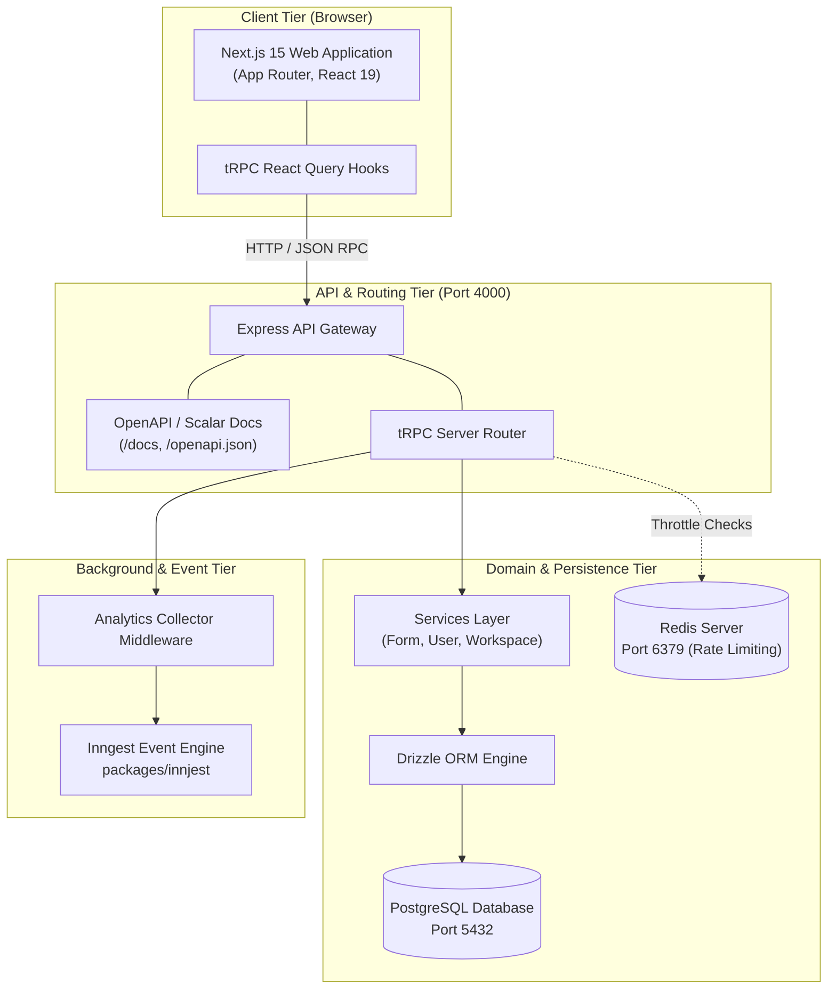
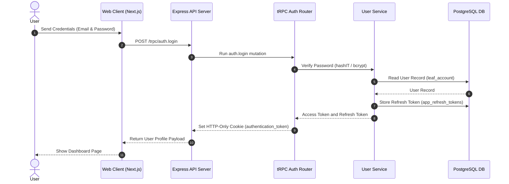
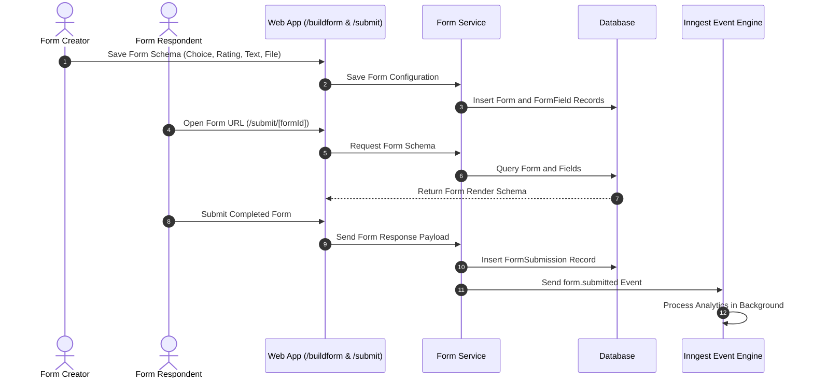
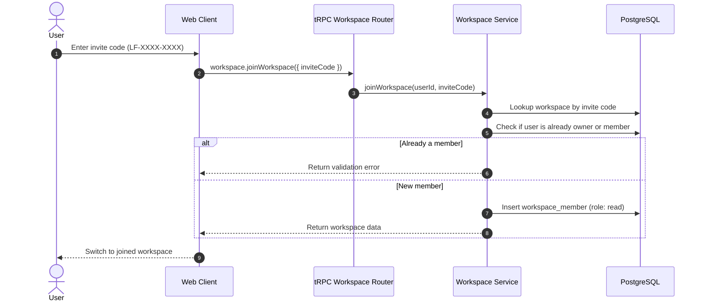

# 🏗️ LeafForm System Design and Architecture (ASD-STE100)

This document describes the system architecture, component data flows, authentication process, and background task processing in LeafForm.

---

## 1. System Topology and Components

LeafForm uses a multi-tier monorepo architecture. The system separates presentation, API delivery, domain services, database storage, and background processing.

---

## 2. Authentication Flow

LeafForm uses Access Tokens (JWT) and Refresh Tokens to authenticate users safely.

### Security Rules

- **Access Token**: Short-lived JWT stored in an `authentication_token` HTTP-only cookie or sent in the `Authorization` header.
- **Refresh Token**: Stored in the `app_refresh_tokens` database table. The server deletes the token when the user logs out.
- **Context Verification**: The `createContext` helper validates JWT tokens with `verifyAccTok`. It attaches user data directly to `ctx.user`.

---

## 3. Dynamic Form and Submission Flow

LeafForm handles form creation, field configuration, submission processing, and analytics tracking:

---

## 4. Background Processing (`packages/innjest`)

The system processes analytics tasks asynchronously without slowing API responses:

1. **Analytics Collector**: The `createAnalyticsMiddleware` in [trpc.ts](file:///home/dron/Documents/programming/monoreop-tRPC/packages/trpc/server/trpc.ts) records latency, payload size, and IP addresses.
2. **Analytics Dashboard**: Express serves analytics endpoints at `/api/analytics` and redirects `/analytics` to the dashboard (`/api/analytics/dashboard`).
3. **Request Throttling**: The `fixedWindowRateLimiter` middleware tracks requests per IP using Redis (`FWRL:<ip>`) to block spam requests.

---

## 5. Database Schema Overview

Data models in [models/](file:///home/dron/Documents/programming/monoreop-tRPC/packages/database/models) define the core database tables:

- **Users (`leaf_account`)**: Stores user credentials, email addresses, and profile data.
- **Refresh Tokens (`app_refresh_tokens`)**: Stores active user session tokens with expiration dates.
- **Workspaces (`leaf_workspaces`)**: Stores workspace name, owner ID, and a unique invite code (`LF-XXXX-XXXX`).
- **Workspace Members (`leaf_workspace_members`)**: Maps users to workspaces with a role (`owner`, `read`, `write`).
- **Forms (`form`)**: Stores form titles, descriptions, owner IDs, workspace reference, and status.
- **Form Fields (`form_fields`)**: Stores field types (text, choice, rating, file upload, payment, captcha, etc.).
- **Field Validations (`leaf_field_validations`)**: Stores regex validation patterns and error messages per field type to run dynamic validations.
- **Form Submissions (`form_submissions`)**: Stores submitted responses in JSON format.

---

## 6. Workspace & Role-Based Access

LeafForm supports multi-tenant workspaces with role-based access control. Each user gets a default workspace on signup. Users can create additional workspaces (up to 5) or join others via invite codes.

### Roles

| Role    | Create/Edit Forms | Delete Forms | View Forms | Manage Members |
| ------- | ----------------- | ------------ | ---------- | -------------- |
| `owner` | ✅                | ✅           | ✅         | ✅             |
| `write` | ✅                | ✅           | ✅         | ❌             |
| `read`  | ❌                | ❌           | ✅         | ❌             |

### Workspace Join Flow

### Key Implementation Details

- **Auto-provisioning**: `WorkspaceService.provisionDefaultWorkspace()` runs during user signup in `UserService`, creating a default "My Workspace" with a unique invite code.
- **Invite codes**: Generated as `LF-XXXX-XXXX` format using alphanumeric characters.
- **Frontend context**: A global `WorkspaceProvider` shares the active workspace and workspace list across all authenticated pages. The query is disabled on public pages (`/welcome`, `/`) to prevent unauthorized API calls before login.

---

## 7. Environment Configuration

- **Environment Validation**:
  - The web application validates variables with `@t3-oss/env-nextjs` in [env.js](file:///home/dron/Documents/programming/monoreop-tRPC/apps/web/env.js).
  - The API server validates variables with Zod in [env.ts](file:///home/dron/Documents/programming/monoreop-tRPC/apps/api/src/env.ts).
  - The database layer validates connection strings in [env.ts](file:///home/dron/Documents/programming/monoreop-tRPC/packages/database/env.ts).
- **Docker Setup**: The `docker-compose.yml` file configures PostgreSQL on port `5432` and Redis on port `6379`.
